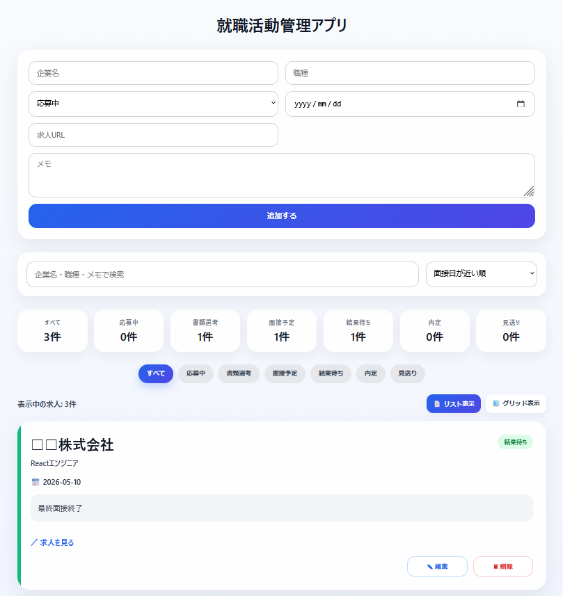
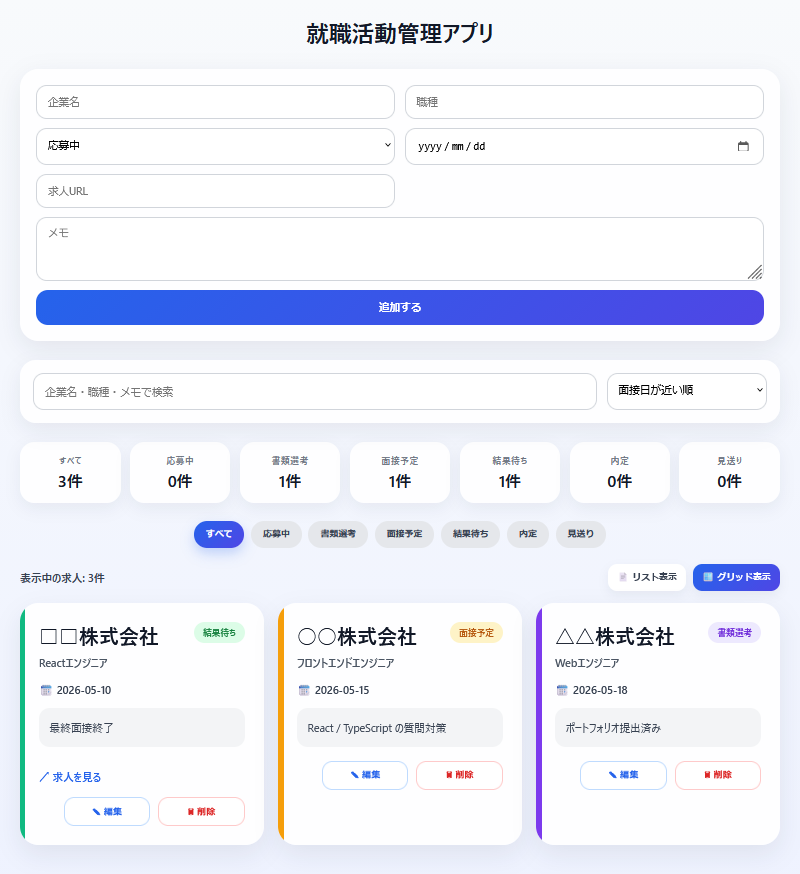

# 就職活動管理アプリ

React / Vite を用いて作成した就職活動管理アプリです。  
応募企業や面接日、選考状況などを管理できる実用的な CRUD アプリとして開発しました。

---

# アプリ概要

就職活動時に、応募企業や選考状況の管理が煩雑になった経験から作成しました。  
求人情報・面接日・メモなどを一元管理できるようにし、実際に利用することを意識して UI / UX を設計しています。

---

# 主な機能

- 求人追加 / 編集 / 削除（CRUD）
- ステータス管理
- 面接日管理
- 企業検索機能
- 並び替え機能
- リスト表示 / グリッド表示切替
- LocalStorage によるデータ保存
- 近日面接表示
- レスポンシブ対応

---

# 使用技術

- React
- Vite
- JavaScript
- CSS
- LocalStorage

---

# 工夫した点

## UI / UX

- ステータスごとにカードカラーを変更
- リスト表示 / グリッド表示切替を実装
- 管理しやすいよう検索・並び替えを追加
- 実務ツールを意識したシンプルな UI 設計

## React設計

- useState / useEffect を用いた状態管理
- LocalStorage によるデータ永続化
- filter / map / sort を利用したデータ操作
- 編集時にフォームへ値を自動反映

---

# スクリーンショット

## リスト表示



## グリッド表示



---

# セットアップ

```bash
npm install
npm run dev
```

---

# 今後追加したい機能

- ダークモード
- Toast通知
- Firebase連携
- 認証機能
- API連携