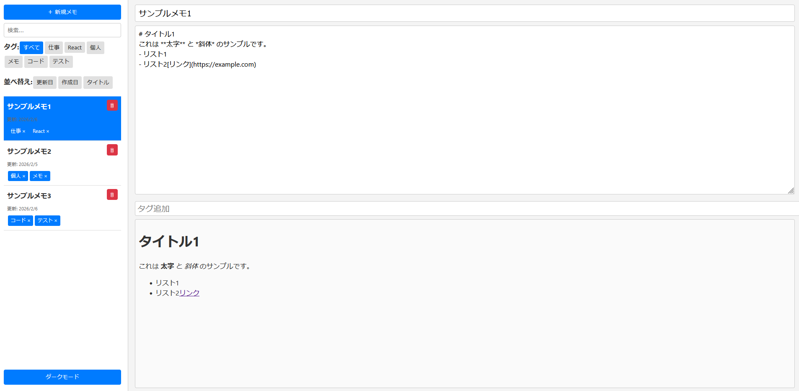

# React Memo App

React + Vite を使用して作成した **ポートフォリオ向けメモアプリ** です。  
タグ管理・Markdownチェックリスト対応・ダークモードなど、実務で役立つ機能を盛り込みました。

---

## 使用技術
- React
- Vite
- JavaScript (ES6+)
- CSS
- [react-markdown](https://github.com/remarkjs/react-markdown) + [remark-gfm](https://github.com/remarkjs/remark-gfm) で Markdown対応

---

## 機能一覧
- メモの追加 / 編集 / 削除
- タイトル・本文・タグ管理
- Markdown対応（チェックリスト、リンク、コードブロックなど）
- タグの追加・削除・フィルタ
- ダークモード切替
- 並べ替え（更新日 / 作成日 / タイトル）
- サイドバー検索
- ローカルストレージ保存（リロードしても消えない）
- 起動時にダミーデータを表示

---

## 工夫した点
- **Markdownチェックリストをそのままプレビューに反映**  
- サイドバーでタグを簡単に管理・フィルタ可能  
- 更新日で色分けすることで直感的に最近更新されたメモを判別  
- ダークモード対応でポートフォリオに映えるデザイン  
- 状態管理は `useState` と `useEffect` を中心にシンプルに設計

---

## ディレクトリ構成
src/  
├── assets/react.svg  
├── dummyMemos.js  
├── App.jsx  
├── App.css  
├── main.jsx  
├── index.css  

---

## セットアップ方法

```bash
# プロジェクト作成
npm create vite@latest react-memo -- --template react
cd react-memo

# 依存関係インストール
npm install react-markdown remark-gfm

# 開発サーバー起動
npm run dev
```

---

## スクリーンショット


