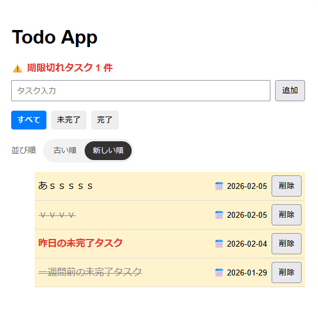

# React Todo App

React + Vite を使用して作成した **シンプルなTodo管理アプリ**です。  
Reactの基本的な状態管理に加え、**実務を意識したUI設計・状態設計**を意識して開発しました。

---

##  使用技術
- React
- Vite
- JavaScript (ES6+)
- CSS
- LocalStorage

---

##  主な機能
- Todoの追加 / 削除
- 完了・未完了の切り替え
- 完了 / 未完了 / 全件フィルタ
- **EnterキーでTodo追加**
- **当日のTodoを自動で日付付与 & 強調表示**
- **期限切れ（未完了）Todoの警告表示**
- **日付順ソート（古い順 / 新しい順）**
- **LocalStorageによるデータ永続化（リロード対応）**

---

##  工夫したポイント
- Todoの状態（完了・未完了・期限切れ）が**一目で分かるUI設計**
- フィルタ・ソート処理を分離し、可読性を意識したロジック構成
- LocalStorageを利用し、ページ更新後も状態を保持
- React Hooks（useState / useEffect / useRef）を用途別に使い分け
- **必要以上に複雑にしない設計**を意識し、拡張しやすい構成に

---

##  ディレクトリ構成

src/  
├──assets/react.svg  
├── App.css  
├── App.jsx  
├── main.jsx  
└── index.css  

---

##  セットアップ方法

```bash
npm install
npm run dev
```

##  画面画像


