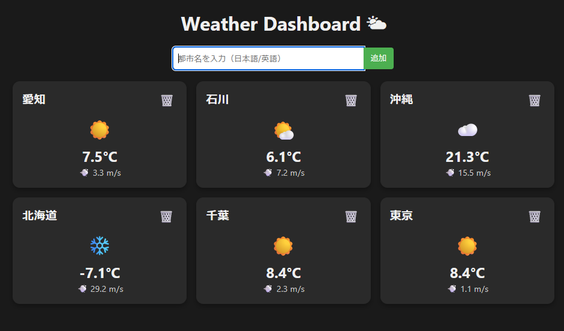

# Weather Dashboard 

React + Vite で作成した天気ダッシュボードアプリです。  
47都道府県の天気をリアルタイムで確認可能。ポートフォリオ向けに日本語対応済みです。

---

## 使用技術
- React
- Vite
- JavaScript (ES6+)
- CSS
- Open-Meteo API（無料・キー不要）

---

## 主な機能
- 都市追加・削除  
- 天気アイコン、気温、風速表示  
- 日本語 / 英語どちらでも都市検索可能   
- ローカルストレージに保存 → リロードしても都市一覧保持  

---

## 特徴
- **日本語表示対応**：カードに都市名を日本語で表示  
- **天気絵文字**：晴れ/曇り/雨/雪などを直感的に確認可能  
- **削除ボタン付き**：都市カードごとに簡単削除  
- **レスポンシブデザイン**：カードがグリッドで並び、画面幅に応じて自動調整  

---

## スクリーンショット



---

## ディレクトリ構成

src/  
├── assets/  
│ └── react.svg  
├── components/  
│ ├── WeatherCard.jsx  
│ └── SearchBar.jsx  
├── CITY_NAMES_JP.js  
├── App.jsx  
├── main.jsx  
├── index.css  
├── app.css  


---

## セットアップ方法

```bash
# 依存関係インストール
npm install

# 開発サーバー起動
npm run dev
